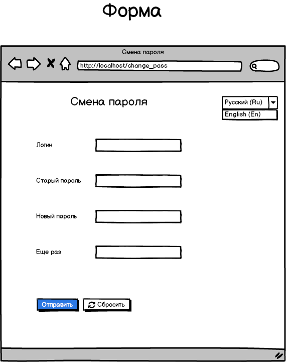
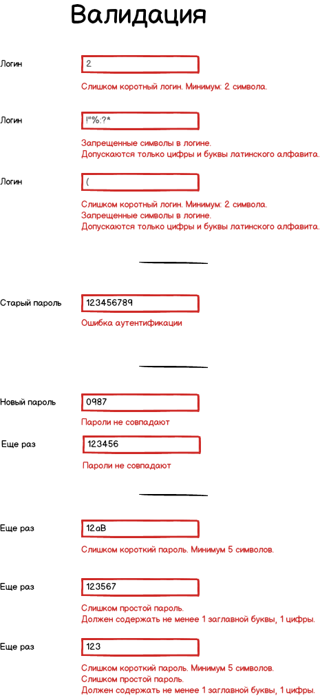

# Описание

Это пример описания требований, предъявляемых к кейсы по смене пароля.
Все требования приведены для наглядной демонстрации работы с ошибками.

## Кейсы

Рассмотрим только один кейс.

### UC1 Изменение пароля пользователя

Любой пользователь имеет возможность поменять **свой** пароль.
Для исключения злонамеренной смены пароля пользователю нужно пройти процедуру подтверждения владения учетной записью,
указав действующий пароль.

#### Макет формы

#### FR1. Подтверждение действующим паролем

#### FR2. Повторное указания нового пароля

#### FR3. Пароль должен соответствовать политике безопасности: не менее 1 символа заглавной латинской буквы, не менее одной цифры, не менее 5 символов

#### FR4. Пароль и логин должны содержать только латинские буквы обоих регистров и цифры

#### FR5. Логин не должен быть короче 2х символов

#### FR6. Валидация выполняется полностью на стороне бекенда (!)

### Валидация

Возможна ситуация, когда на одном поле может сработать несколько правил валидации.
В этом случае пользователю необходимо отобразить все ошибки.

#### Сообщения ошибок валидации

| Поле | Ошибка | Сообщение |
| ---- | ------ | --------- |
| Логин, Новый пароль | Короткий логин/пароль | Слишком короткий {{.Field}}. Минимум: {{.Num}} символа. |
| Логин | Запрещенные символы | Запрещенные символы в логине. Допускаются только цифры и буквы латинского алфавита. |
| Новый пароль | Слишком простой пароль. Должен содержать не менее {{.Alpha}} заглавной буквы, {{.Digit}} цифры. |

#### Сообщения ошибок

| Поле | Ошибка | Сообщение |
| ---- | ------ | --------- |
| Новый пароль, Еще раз | Пароли не совпадают. Отображать ошибку на обоих inputs. | Пароли не совпадают |
| Старый пароль | Ошибка проверка подлинности пользователя | Ошибка аутентификации |

#### Форма с примерами валидации

